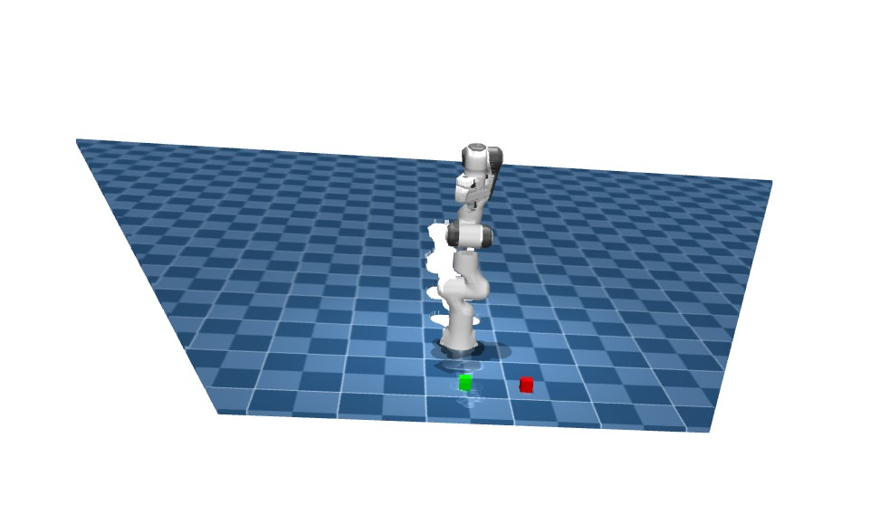
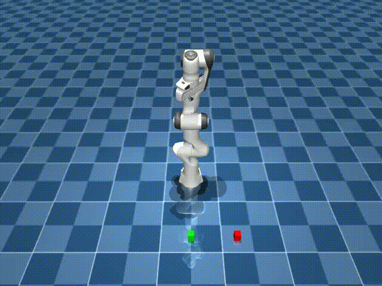

# Pick and Place using state estimation from a 3D pointcloud and ROS2 

This project implements a pick and place task using a Franka Emika Panda robot. We use ROS2 Jazzy to interface with the robot and MuJoCo for simulation. The system takes in a 3D pointcloud of the scene, estimates the state of the objects, and executes a pick and place operation.

System Requirements: Ubuntu 24.04 and ROS2 Jazzy

## How to Use
First install the virtual environment by running the following commands in your root workspace:
```
uv venv franka --system-site-packages

# 2. Activate the environment
source franka/bin/activate

# 3. Install the required Python packages
uv pip install -r requirements.txt
```
We can then build the package using the following alias:
```
alias build='source ~/ros2_ws/franka/bin/activate && cd ~/ros2_ws/ && colcon build --symlink-install && source install/setup.bash'
build
```
Using an alias makes it easier to build everytime instead of using the same commands

To start the simulation, run the following command inside your workspace:
```
ros2 run franka_mujoco start_sim
```
This command launches the simulation

In a separate terminal, you can run the following scripts and change them to your liking.

The forward kinematics script helps calculate the end effector position and compares the difference between the end effector position we have in simulation:
```
ros2 run franka_mujoco forward_kin
```

The inverse kinematics script will take in a goal position and calculate the joint positions the robot needs to move to. You can either set the goal state within the script or right a separate script to send goal states
```
ros2 run franka_mujoco inverse_kin
```

The camera pick and place script generates a 3d pointcloud and uses color filters to find the center of the red and green cube. To run this script, you will need to have the simulation, and inverse kinematics scripts running and in a new terminal run:
```
ros2 run franka_mujoco cam_pick_and_place
```
By defualt the robot will try to pick up the red cube. If you want it to the grab the green cube run: 
```
ros2 run franka_mujoco cam_pick_and_place --green
```

## Results
Pointcloud generated from cameras:
<p align="center">
  
</p>

Pick and Place for red and green cubes:
<p align="center">
  
  &nbsp; &nbsp; &nbsp; &nbsp;
  
</p>
